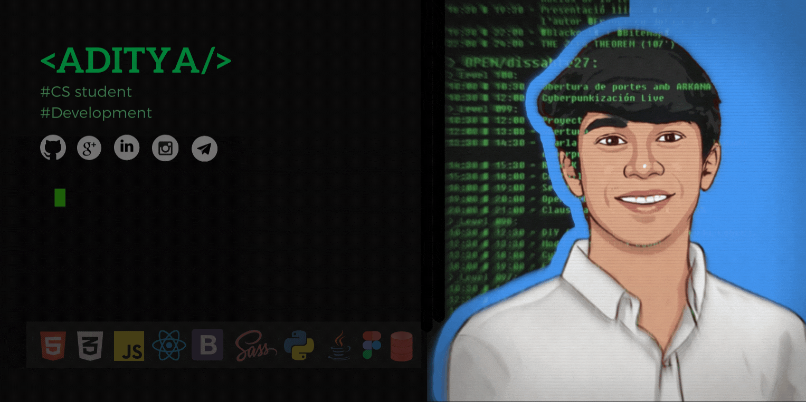

### Hi there 👋, I am Aditya

- 🌱 I’m currently learning everything 🤣
- 👯 I’m looking to collaborate with other Developers
- 🥅 2021 Goals: Contribute more to Open Source projects

<!-- ![I am Computer Science Student] -->
----

I'm Aditya Chauhan an Energetic fresher with having good
knowledge of computer subjects. the goal is to convert
my ideas into the computer with my skills. also eager to know more
about personality development with a strong willingness to become
the best personality compare to what I am some years before.

### Connect with me:

  &nbsp;        &nbsp;   &nbsp;    &nbsp;   &nbsp;     

 

### Languages and Tools:

[][vscode] &nbsp; 
[][html5] &nbsp; 
[][css3] &nbsp; 
[][sass] &nbsp; 
[][js] &nbsp; 
[][adobe] &nbsp; 
[][figma]   &nbsp; 
[][react] &nbsp; 
[][python] &nbsp; 
[][java] &nbsp; 
[][sql] &nbsp; 
[][bootstrap] &nbsp; 
[][django]  

[instagram]: https://www.instagram.com/adi_._2703/
[linkedin]: https://www.linkedin.com/in/aditya-2703
[vscode]: https://code.visualstudio.com/
[html5]: https://developer.mozilla.org/en-US/docs/Glossary/HTML5
[css3]: https://developer.mozilla.org/en-US/docs/Web/CSS
[sass]: https://sass-lang.com/
[js]: https://www.javascript.com/
[python]: https://www.python.org/
[java]: https://www.java.com/en/
[react]: https://reactjs.org/
[sql]: https://livesql.oracle.com/apex/f?p=590:1000
[bootstrap]: https://getbootstrap.com/
[adobe]: https://www.adobe.com/products/xd.html?sdid=12B9F15S&mv=Search&ef_id=Cj0KCQjw5uWGBhCTARIsAL70sLIexnqc0cFaxWAI4YXnQ6MhfQL_9ny7GBXkgh22KgDR1Gh1syHHaUEaAsRkEALw_wcB:G:s&s_kwcid=AL!3085!3!526748867468!e!!g!!adobe%20xd!1641846448!65452677551  
[figma]: https://www.figma.com/
[django]: https://www.djangoproject.com/
  

